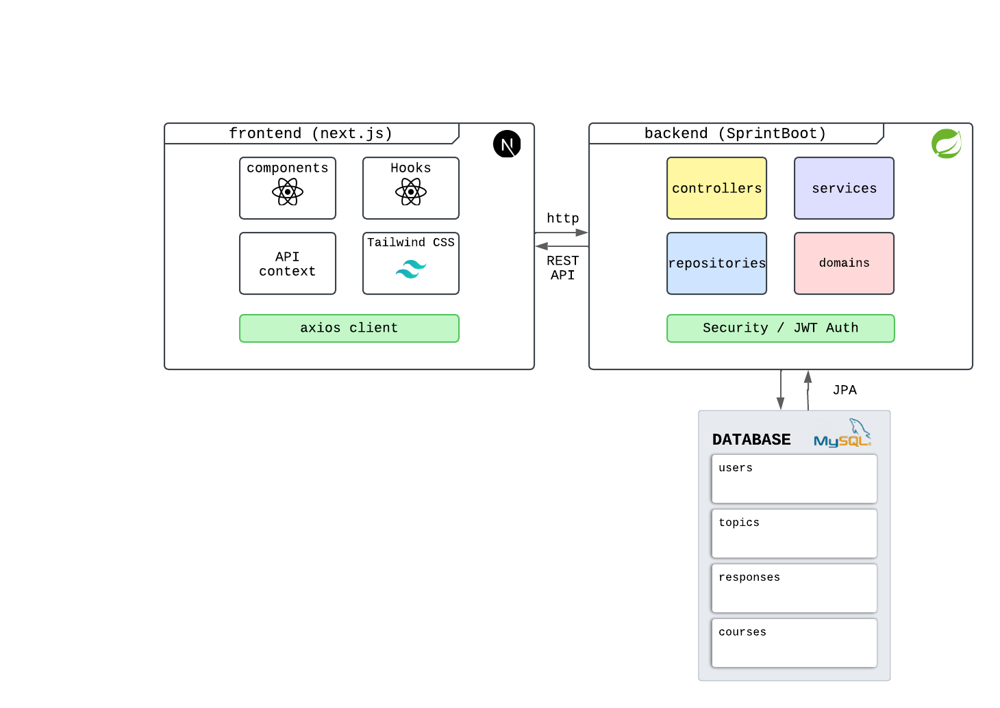

# Foro Luna 🌙

## Descripción

Foro Luna es una plataforma de comunidad para desarrolladores que permite crear y participar en discusiones técnicas organizadas por temas y categorías. La aplicación está diseñada con una arquitectura moderna de microservicios, separando el frontend y el backend para un mejor mantenimiento y escalabilidad.

## Características principales

- 👤 Sistema de autenticación basado en JWT
- 📝 Creación de tópicos de discusión con título, contenido y categoría
- 💬 Comentarios y respuestas a los tópicos
- 🔍 Búsqueda y filtrado de temas
- 📱 Interfaz responsive y moderna
- 🌐 API RESTful completa

## Estructura del proyecto

El proyecto se divide en dos partes principales:

- **Backend**: Desarrollado con Spring Boot (Java 17)
- **Frontend**: Desarrollado con Next.js (React 19) y Tailwind CSS

## Requisitos previos

- Java 17 o superior
- Node.js 18 o superior
- MySQL 8.0 o superior
- Maven 3.6 o superior
- npm o yarn

## Arquitectura General de la Aplicación

 

