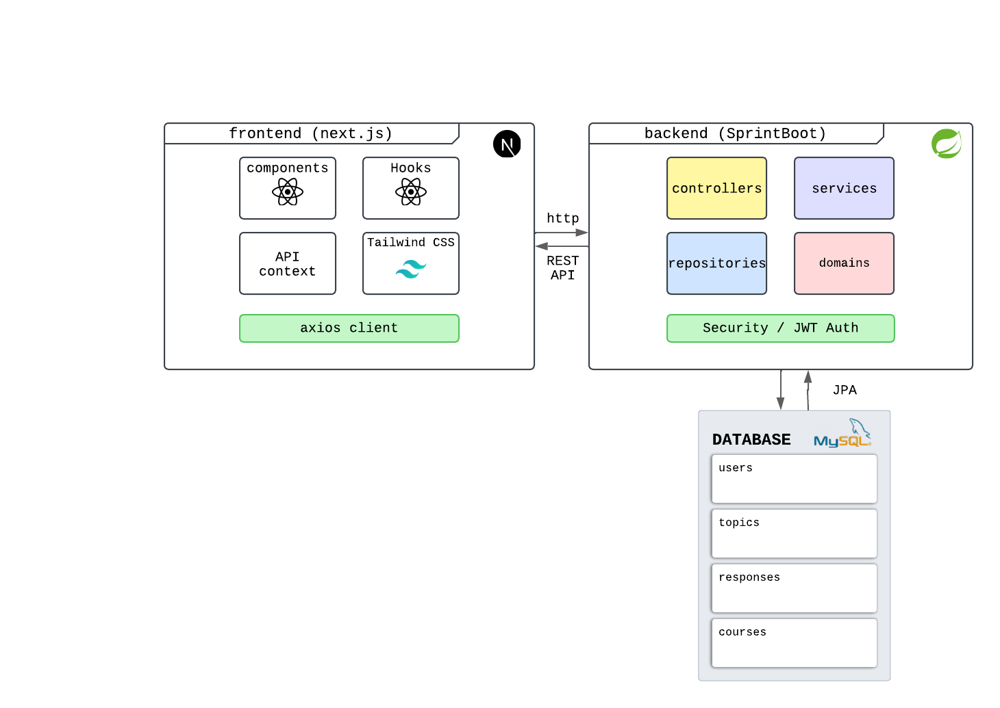

# Foro Luna 🌙

[](https://github.com/lunajulio/ForoLuna/actions/workflows/ci-cd.yml)
[](https://github.com/lunajulio)


Foro Luna es una comunidad para desarrolladores. Los usuarios publican preguntas (tópicos) organizadas por curso y categoría, y la comunidad las responde.

El proyecto cubre el ciclo completo de una aplicación web:
- una **API REST en Spring Boot** con seguridad JWT;
- un **frontend en Next.js**;
- **tests automatizados**;
- **despliegue en AWS con Docker**;
- un **pipeline de CI/CD en GitHub Actions**.

---

## Índice
1. [Funcionalidades](#-funcionalidades)
2. [Arquitectura general](#-arquitectura-general)
3. [Herramientas y tecnologías](#-herramientas-y-tecnologías)
4. [Arquitectura del backend y principios aplicados](#-arquitectura-del-backend-y-principios-aplicados)
5. [Arquitectura del frontend](#-arquitectura-del-frontend)
6. [API REST](#-api-rest)
7. [Estructura del repositorio](#-estructura-del-repositorio)
8. [Desarrollo local](#-desarrollo-local)
9. [Testing](#-testing)
10. [Despliegue en AWS](#-despliegue-en-aws)
11. [CI/CD con GitHub Actions](#-cicd-con-github-actions)
12. [Del commit a producción: el proceso completo](#-del-commit-a-producción-el-proceso-completo)
13. [Seguridad](#-seguridad)
14. [Próximos pasos](#-próximos-pasos)

---

## ✨ Funcionalidades

- 👤 **Registro e inicio de sesión** con contraseñas cifradas (BCrypt) y sesiones sin estado mediante **JWT**.
- 📝 **Tópicos:** crear, listar con paginación, ver, editar y eliminar. Solo el **autor** puede editar o eliminar los suyos.
- 🏷️ **Cursos y categorías:** cada tópico pertenece a un curso (por ejemplo "React Hooks · Programación Frontend"), que se reutiliza si ya existe.
- 💬 **Respuestas:** cualquier usuario autenticado puede responder, y las respuestas se muestran en orden cronológico.
- 🗑️ **Borrado lógico:** los tópicos eliminados se ocultan pero se conservan en la base de datos.
- ⚠️ **Errores claros:** la API responde con códigos HTTP correctos (400, 401, 403, 404, 409) y un mensaje que la interfaz muestra al usuario.

## 🏗 Arquitectura general



En producción todo corre en **un servidor EC2** con Docker Compose, detrás de un proxy inverso con HTTPS automático:

```
                        ┌───────────────────── EC2 (Ubuntu + Docker Compose) ─────────────────────┐
 Navegador ──HTTPS:443──▶ Caddy (proxy inverso + Let's Encrypt)                                  │
                        │   ├── /api/*  ──▶ backend  · Spring Boot :8080 ──▶ MySQL 8 :3306        │
                        │   └── /*      ──▶ frontend · Next.js      :3000     (volumen persistente)│
                        └──────────────────────────────────────────────────────────────────────────┘
                                   ▲
 GitHub Actions ──SSH (solo durante el deploy)──┘
```

- El frontend y la API comparten dominio (`/` y `/api`), así que no hay problemas de CORS ni de contenido mixto.
- Solo los puertos **80 y 443** son públicos. El backend y MySQL solo son accesibles dentro de la red de Docker.

## 🧰 Herramientas y tecnologías

| Capa | Tecnología | Uso |
|---|---|---|
| **Backend** | Java 17, **Spring Boot 3.3** | API REST |
| | Spring Web, Spring Data JPA, Hibernate | Controladores, repositorios y ORM |
| | **Spring Security** + **java-jwt** (Auth0) | Autenticación stateless con JWT y BCrypt |
| | Bean Validation (Jakarta) | Validación de las peticiones |
| | **Flyway** | Migraciones versionadas del esquema |
| | Lombok | Menos código repetitivo en las entidades |
| | springdoc-openapi (Swagger UI) | Documentación interactiva de la API |
| **Base de datos** | **MySQL 8** | Persistencia |
| **Frontend** | **Next.js 15** (App Router), **React 19**, TypeScript 5 | Interfaz web |
| | Tailwind CSS 4 | Estilos |
| | axios, react-hook-form, date-fns, react-icons | HTTP, formularios, fechas e iconos |
| **Testing** | **JUnit 5**, **Mockito**, AssertJ, MockMvc, Spring Boot Test | Tests unitarios y de integración |
| | H2 (modo MySQL) | Base de datos en memoria para los tests |
| | **JaCoCo** | Cobertura de código |
| | ESLint | Análisis estático del frontend |
| **Contenedores** | **Docker** (builds multi-etapa), **Docker Compose** | Empaquetado y orquestación |
| | **Caddy 2** | Proxy inverso y certificados HTTPS automáticos |
| **Cloud** | **AWS EC2**, Elastic IP, Security Groups, **IAM + OIDC** | Infraestructura |
| | sslip.io | DNS gratuito basado en la IP |
| **CI/CD** | **GitHub Actions** | Integración y despliegue continuos |
| | actionlint, shellcheck | Validación del workflow y de los scripts |

## 🧱 Arquitectura del backend y principios aplicados

### Capas

```
 HTTP ─▶ ┌──────────────┐   DTOs (records)   ┌──────────────────┐        ┌─────────────────┐
         │  controller  │ ─────────────────▶ │ servicios /      │ ─────▶ │  repositorios   │ ─▶ MySQL
         │ (REST, sin   │ ◀───────────────── │ reglas de negocio│ ◀───── │  (Spring Data)  │
         │  lógica SQL) │                    │ (entidades ricas)│        └─────────────────┘
         └──────────────┘                    └──────────────────┘
                ▲                                     ▲
     infra/errores (manejo global)       infra/security (JWT, filtros, config)
```

| Paquete | Responsabilidad |
|---|---|
| `controller` | Traduce HTTP ⇄ casos de uso: recibe DTOs validados, delega y devuelve DTOs y el código HTTP. |
| `domain.<agregado>` | Cada agregado (`topico`, `respuesta`, `curso`, `usuarios`) agrupa su **entidad**, su **repositorio** y sus **DTOs**. |
| `infra.security` | Detalles técnicos de seguridad (JWT, filtro, configuración de Spring Security) y los servicios de aplicación de usuarios y respuestas. |
| `infra.errores` | Traducción centralizada de excepciones a respuestas HTTP. |

### Principios aplicados

- **Separación de responsabilidades por capas.** Los controladores no contienen SQL, y la persistencia queda detrás de interfaces de repositorio.
- **Organización por dominio (package by feature).** Todo lo relacionado con un agregado vive junto (`domain/topico/*`), lo que facilita encontrar y cambiar el código.
- **DTOs inmutables como contrato de la API.** Records de Java (`DatosSubirTopico`, `DatosRespuestaTopico`…) separan el modelo interno de lo que se expone:
  - las entidades nunca se serializan directamente;
  - no se filtran hashes de contraseñas;
  - no se producen referencias circulares.
- **Modelo de dominio rico.** Las reglas del negocio viven en la entidad, no dispersas en los controladores: `Topico.actualizarTopico()` (edición parcial), `deshabilitarTopico()` (borrado lógico) y `esAutor()` (autorización).
- **Patrón repositorio.** Spring Data JPA genera las consultas a partir de nombres expresivos (`findByIdAndStatusTrue`, `existsByTituloAndStatusTrue`).
- **Inyección de dependencias e inversión de control.** Los componentes dependen de abstracciones (`PasswordEncoder`, `UserDetailsService`, repositorios), inyectadas por Spring. Esto permite sustituirlas por *mocks* en los tests unitarios.
- **Manejo de errores centralizado.** `TratadorDeErrores` (`@RestControllerAdvice`) convierte las excepciones en respuestas uniformes `{ "message": … }`. Las reglas de negocio lanzan `ValidacionException` con su código HTTP, de modo que los controladores no tienen bloques `try/catch`.
- **Validación en el borde.** Bean Validation (`@NotBlank`, `@Valid`) rechaza los datos inválidos antes de llegar a la lógica.
- **Seguridad stateless.** Cada petición se autentica por su JWT (`SecurityFilter`), sin sesiones en el servidor, lo que facilita escalar horizontalmente.
- **Esquema versionado como código.** Flyway aplica migraciones inmutables (`V1…V5`). El mismo esquema se usa en producción y en los tests.
- **Configuración externalizada** (*twelve-factor app*). Credenciales, secretos, CORS y URLs llegan por variables de entorno; el mismo artefacto sirve para desarrollo, tests y producción.

### Hacia una arquitectura limpia estricta

El proyecto sigue una **arquitectura en capas pragmática**. Para una *Clean Architecture* estricta (dominio independiente de los frameworks) faltaría:

| Situación actual | Evolución propuesta |
|---|---|
| Las entidades de dominio llevan anotaciones JPA | Separar el modelo de dominio de las entidades de persistencia (adaptadores) |
| `TopicoController` usa los repositorios directamente | Extraer un caso de uso o servicio `TopicoService` |
| Los servicios de aplicación están en `infra.security` | Moverlos a una capa `application/` independiente de la infraestructura |
| Los repositorios son interfaces de Spring Data | Definir *puertos* propios en el dominio e implementarlos con Spring Data |

## 🎨 Arquitectura del frontend

```
src/
├── app/            Rutas (App Router): /, /login, /register, /topico
├── components/     Componentes de UI (Questions, Ask, EditQuestion, NavMain…)
├── services/       Acceso a la API: api.ts (axios + interceptores), topicService.ts
└── types/          Tipos TypeScript del dominio y de las respuestas del backend
```

- **Una única puerta a la API.** `services/api.ts` centraliza la URL base (configurable con `NEXT_PUBLIC_API_URL`) y tiene dos interceptores:
  - **añade el token JWT** a cada petición;
  - **cierra la sesión automáticamente** si el backend responde 401 (token expirado).
- **Errores del backend en la interfaz.** `getErrorMessage()` extrae el `message` que envía la API, para mostrarlo al usuario.
- **Rutas protegidas.** `ProtectedRoute` redirige a `/login` si no hay sesión.
- **Build standalone.** Next.js genera un servidor mínimo para la imagen Docker de producción.

## 🌐 API REST

Base local: `http://localhost:8080` · En producción: `https://<dominio>/api`

| Método | Ruta | Auth | Descripción | Respuestas |
|---|---|---|---|---|
| `POST` | `/usuarios` | — | Registrar usuario | 200 · 400 · 409 |
| `POST` | `/login` | — | Iniciar sesión, devuelve `{ jwTtoken }` | 200 · 400 · 401 |
| `GET` | `/topico?page=0&size=10` | JWT | Listar tópicos activos (paginado) | 200 · 401 |
| `POST` | `/topico` | JWT | Crear tópico | 201 · 400 · 409 |
| `GET` | `/topico/{id}` | JWT | Detalle con sus respuestas | 200 · 404 |
| `PUT` | `/topico/{id}` | JWT (autor) | Editar título y/o mensaje | 200 · 403 · 404 |
| `DELETE` | `/topico/{id}` | JWT (autor) | Eliminar (borrado lógico) | 204 · 403 · 404 |
| `GET` | `/topico/{id}/respuestas` | JWT | Listar respuestas | 200 · 404 |
| `POST` | `/topico/{id}/respuestas` | JWT | Responder | 200 · 400 · 404 |

Ejemplo de creación de un tópico:

```http
POST /topico
Authorization: Bearer <token>
Content-Type: application/json

{ "titulo": "¿Cómo funciona useEffect?", "mensaje": "…",
  "curso": { "nombre": "React Hooks", "categoria": "Programación Frontend" } }
```

La documentación interactiva (Swagger UI) está disponible en local en <http://localhost:8080/swagger-ui/index.html>.

## 📁 Estructura del repositorio

```
ForoLuna/
├── backend/                      API Spring Boot
│   ├── src/main/java/com/foro/forohub/
│   │   ├── controller/           Endpoints REST
│   │   ├── domain/               topico · respuesta · curso · usuarios
│   │   └── infra/                security (JWT) · errores (manejo global)
│   ├── src/main/resources/db/migration/   Migraciones Flyway V1–V5
│   ├── src/test/                 80 tests JUnit (unitarios, integración, repositorios)
│   └── Dockerfile
├── frontend/                     App Next.js
│   ├── src/
│   └── Dockerfile
├── .github/workflows/ci-cd.yml   Pipeline de CI/CD
├── scripts/deploy.sh             Script de despliegue en el servidor
├── docker-compose.yml            Stack de producción (mysql, backend, frontend, caddy)
├── Caddyfile                     Proxy inverso + HTTPS
├── .env.example                  Plantilla de variables de producción
├── DEPLOY.md                     Guía detallada de despliegue en AWS
├── CICD.md                       Guía detallada de configuración del CI/CD
└── CLAUDE.md                     Contexto del proyecto para Claude Code
```

## 💻 Desarrollo local

### Requisitos
- **Java 17+.** Maven no hace falta, el proyecto incluye `mvnw`.
- **Node.js 20+.**
- **MySQL 8.**
- **Docker Desktop** (opcional), para probar el stack de producción.

### 1. Base de datos
```sql
CREATE DATABASE foroLuna;
```
No hace falta crear las tablas: **Flyway** las crea al arrancar el backend.

### 2. Backend
Define las variables de entorno y arranca la API en <http://localhost:8080>.

**PowerShell:**
```powershell
$env:DB_USER = "root"
$env:DB_PASSWORD = "tu_contraseña"
cd backend
.\mvnw spring-boot:run
```

**Bash:**
```bash
export DB_USER=root DB_PASSWORD=tu_contraseña
cd backend && ./mvnw spring-boot:run
```

| Variable | Por defecto | Descripción |
|---|---|---|
| `DB_USER` / `DB_PASSWORD` | — (obligatorias) | Credenciales de MySQL |
| `DB_HOST` | `localhost:3306` | Host de MySQL |
| `JWT_SECRET` | `123456` | Secreto de firma de los JWT (**cámbialo en producción**) |
| `CORS_ALLOWED_ORIGINS` | `http://localhost:3000` | Orígenes permitidos |

### 3. Frontend
```bash
cd frontend
npm install
npm run dev
```
La app queda en <http://localhost:3000>. Por defecto llama a la API en `http://localhost:8080`; se puede cambiar con `NEXT_PUBLIC_API_URL`.

### 4. (Opcional) Stack completo con Docker
Replica exactamente el entorno de producción:
```bash
cp .env.example .env    # completa los valores; usa DOMAIN=localhost
docker compose up -d --build
```
Luego abre <https://localhost> (con un certificado local autofirmado).

## 🧪 Testing

El backend tiene **80 tests JUnit 5**, con un **88 % de líneas** y un **96 % de ramas** cubiertas. Corren sobre **H2 en memoria**, así que no necesitan MySQL:

```bash
cd backend
./mvnw test                          # todos
./mvnw test -Dtest=TokenServiceTest  # una clase
```

| Nivel | Qué prueba | Herramientas |
|---|---|---|
| **Unitarios** | `TokenService`, `SecurityFilter`, `UsuarioService`, `RespuestasService`, `AutenticacionService`, entidad `Topico` y DTOs | JUnit 5, Mockito, AssertJ |
| **Repositorios** | Consultas JPA y restricciones de la base (curso único, login único) contra el esquema real de Flyway | `@DataJpaTest`, H2 |
| **Integración** | La API completa vía HTTP: autenticación, autorización por autor, validaciones, códigos de error, paginación, borrado lógico | `@SpringBootTest`, MockMvc |

- **Cobertura:** el informe queda en `backend/target/site/jacoco/index.html`. En el CI se publica como artefacto descargable.
- **Frontend:** se valida con `npm run lint` y con `npm run build`, que incluye el chequeo de tipos de TypeScript.

## ☁️ Despliegue en AWS

La aplicación se despliega en una **instancia EC2** (capa gratuita) con Docker Compose. La guía paso a paso está en **[DEPLOY.md](DEPLOY.md)**.

1. **Imágenes Docker multi-etapa.**
   - Backend: compila con Maven y ejecuta solo con el JRE, como usuario sin privilegios.
   - Frontend: `npm ci`, `next build` y un servidor *standalone* mínimo.
2. **Orquestación con `docker-compose.yml`.**
   - MySQL con volumen persistente y *healthcheck*. El backend espera a que la base esté sana.
   - Ajustes para servidores de 1 GB de RAM: `innodb-buffer-pool` reducido y `-Xmx384m`.
3. **HTTPS automático.** Caddy obtiene y renueva el certificado de Let's Encrypt. El dominio sale gratis de sslip.io a partir de la Elastic IP.
4. **Infraestructura en AWS.**
   - EC2 `t3.micro` con Ubuntu 24.04 y 2 GB de swap.
   - Elastic IP (dirección fija).
   - Security group con 80/443 abiertos y 22 solo desde la IP del administrador.
5. **Secretos.** Viven en un `.env` del servidor (plantilla: `.env.example`) y nunca se suben al repositorio.
6. **Operación.** DEPLOY.md cubre también: respaldos con `mysqldump`, acceso a la base con MySQL Workbench por túnel SSH y solución de problemas.

## 🔄 CI/CD con GitHub Actions

El workflow [.github/workflows/ci-cd.yml](.github/workflows/ci-cd.yml) automatiza la verificación y el despliegue. La configuración paso a paso está en **[CICD.md](CICD.md)**.

```
 push / PR ─▶ ┌─ Backend · tests (JUnit + JaCoCo) ─┐
              └─ Frontend · lint y build ──────────┤  en paralelo
                                                   ▼  ¿todo verde y es master?
              Desplegar en EC2:
                1. Credenciales temporales de AWS con OIDC (sin claves guardadas)
                2. Abre el puerto 22 solo para la IP del runner
                3. SSH → scripts/deploy.sh <commit>  (git reset + docker compose up --build)
                4. Verifica que el frontend y la API responden
                5. Cierra el puerto 22 (siempre, aunque falle)
```

| Evento | CI | CD |
|---|---|---|
| Pull Request hacia `master` | ✅ | — |
| Merge o push a `master` | ✅ | ✅ si el CI pasa |
| *Run workflow* manual | ✅ | ✅ |

**Decisiones de diseño:**
- **OIDC en lugar de claves de AWS.** GitHub obtiene credenciales temporales. El rol de IAM solo puede abrir y cerrar reglas de **un** security group, y solo desde el entorno `production` de este repositorio.
- **Puerto SSH cerrado por defecto.** Se abre únicamente durante el despliegue y para una sola IP.
- **Llave SSH dedicada** para despliegues, revocable sin afectar el acceso del administrador.
- **Protección contra despliegues simultáneos.** `concurrency` impide dos despliegues a la vez y nunca cancela uno a medias.
- **Despliegue reproducible.** El servidor se posiciona en el **commit exacto** que pasó el CI.
- **Verificación posterior.** Tras desplegar se comprueba que la app responde; si no, el job falla y se ve en GitHub.

## 🚀 Del commit a producción: el proceso completo

```
 1. Desarrollar         2. Verificar local        3. Pull Request           4. Merge          5. Producción
 ─────────────────      ──────────────────        ───────────────           ────────          ─────────────
 git checkout -b x      ./mvnw test               git push -u origin x      Merge a master    CD despliega en EC2
 código + tests         npm run lint              CI: tests + build ✅/❌    CI de nuevo ✅     Flyway migra la BD
 migración V6__…sql     npm run dev               revisión del código                         verificación HTTPS
```

1. **Desarrollo.**
   - Crea una rama para el cambio.
   - Si cambia el esquema, añade una migración nueva (`V6__descripcion.sql`); **nunca edites las existentes**.
   - Escribe tests junto al código.
2. **Verificación local.** Ejecuta `./mvnw test` para el backend y `npm run lint` más `npm run build` para el frontend.
3. **Pull Request.** GitHub Actions ejecuta el CI. Con la protección de rama activada (ver [CICD.md](CICD.md)), solo se puede hacer merge con los checks en verde.
4. **Merge a `master`.** Se repite el CI y, si pasa, se despliega automáticamente.
5. **Producción.** `docker compose` reconstruye solo las imágenes que cambiaron, Flyway aplica las migraciones pendientes al arrancar el backend y el pipeline verifica que todo responde.
6. **Rollback.** Si algo sale mal, `git revert <commit>` y `git push` vuelven a desplegar la versión anterior por el mismo camino.

## 🔒 Seguridad

- **Autenticación.**
  - Contraseñas con **BCrypt**.
  - JWT firmado con HMAC-256 que expira a los 5 días.
  - Se rechazan tokens manipulados, expirados o de otro emisor.
- **Autorización.** Solo el autor puede editar o eliminar su tópico. El autor se obtiene del token, nunca del cuerpo de la petición.
- **Respuestas de la API.**
  - Los DTOs nunca exponen hashes ni entidades internas.
  - Los errores no incluyen *stack traces*.
- **Red.**
  - Solo los puertos 80/443 son públicos.
  - MySQL y la API no están expuestos a Internet.
  - HTTPS obligatorio: HTTP redirige a HTTPS.
- **Secretos.**
  - Viven en variables de entorno o en el `.env` del servidor, y en GitHub Secrets.
  - No hay claves de AWS en GitHub (se usa OIDC).
- **Mínimo privilegio.**
  - El rol de IAM del CD solo gestiona un security group.
  - Las imágenes propias (backend y frontend) corren con usuarios sin privilegios.

## 🗺 Próximos pasos

- [ ] Búsqueda y filtros de tópicos (la interfaz ya los muestra, pero aún no están conectados).
- [ ] Edición y eliminación de respuestas.
- [ ] Capa de servicios de aplicación para tópicos, como paso hacia una arquitectura limpia.
- [ ] Tests del frontend (React Testing Library / Playwright).
- [ ] Respaldos automáticos de MySQL a S3.
- [ ] Guardar las fechas en UTC y formatearlas según la zona horaria del usuario.

---

Hecho con 🌙 por [@lunajulio](https://github.com/lunajulio)
