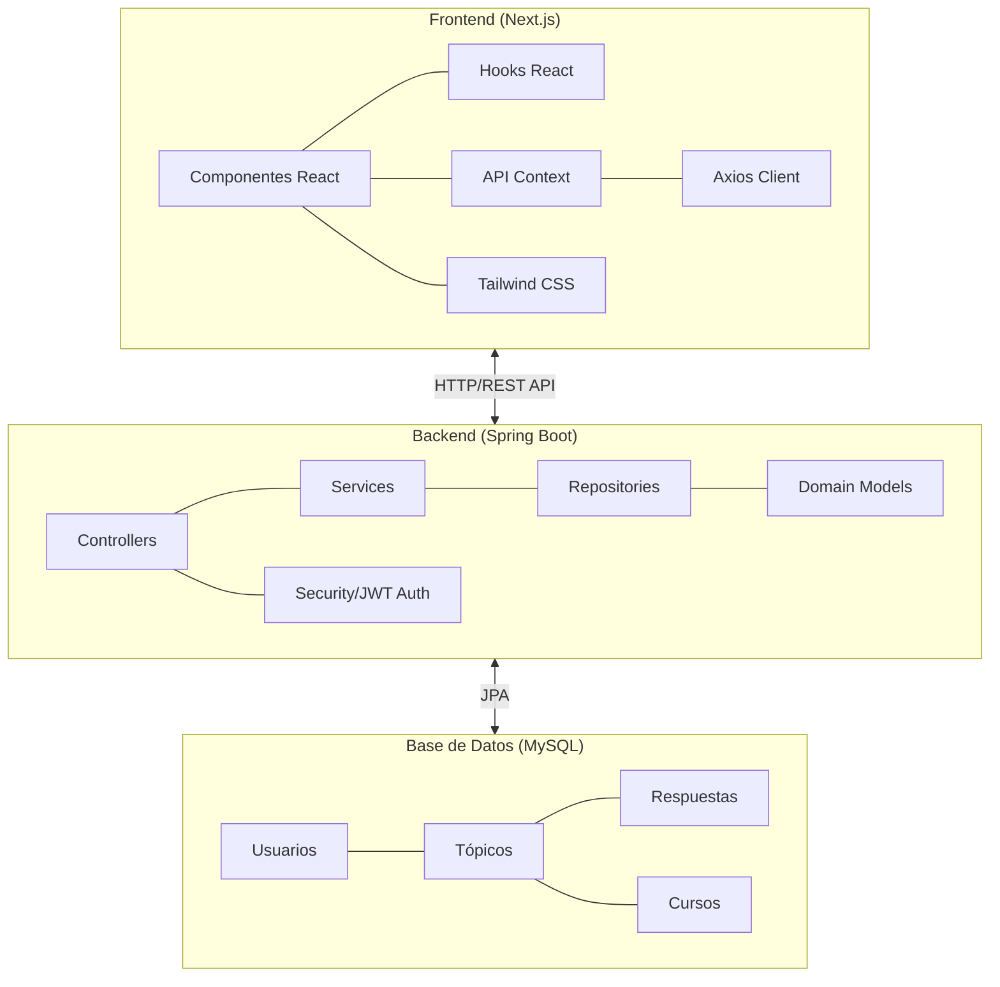

# Foro Luna 🌙

## Descripción

Foro Luna es una plataforma de comunidad para desarrolladores que permite crear y participar en discusiones técnicas organizadas por temas y categorías. La aplicación está diseñada con una arquitectura moderna de microservicios, separando el frontend y el backend para un mejor mantenimiento y escalabilidad.

## Características principales

- 👤 Sistema de autenticación basado en JWT
- 📝 Creación de tópicos de discusión con título, contenido y categoría
- 💬 Comentarios y respuestas a los tópicos
- 🔍 Búsqueda y filtrado de temas
- 📱 Interfaz responsive y moderna
- 🌐 API RESTful completa

## Estructura del proyecto

El proyecto se divide en dos partes principales:

- **Backend**: Desarrollado con Spring Boot (Java 17)
- **Frontend**: Desarrollado con Next.js (React 19) y Tailwind CSS

## Requisitos previos

- Java 17 o superior
- Node.js 18 o superior
- MySQL 8.0 o superior
- Maven 3.6 o superior
- npm o yarn

## Arquitectura General de la Aplicación

```mermaid
graph TD
    subgraph Frontend["Frontend (Next.js)"]
        A1[Componentes React]
        A2[Hooks React]
        A3[API Context]
        A4[Tailwind CSS]
        A5[Axios Client]
    end
    
    subgraph Backend["Backend (Spring Boot)"]
        B1[Controllers]
        B2[Services]
        B3[Repositories]
        B4[Domain Models]
        B5[Security/JWT Auth]
    end
    
    subgraph Database["Base de Datos (MySQL)"]
        C1[Usuarios]
        C2[Tópicos]
        C3[Respuestas]
        C4[Cursos]
    end
    
    Frontend <-->|HTTP/REST API| Backend
    Backend <-->|JPA| Database
    
    A1 --- A2
    A1 --- A3
    A1 --- A4
    A3 --- A5
    
    B1 --- B2
    B2 --- B3
    B3 --- B4
    B1 --- B5
    
    C1 --- C2
    C2 --- C3
    C2 --- C4
```

 

